# Sticky Keys -> CMD

### Just to clarify: There is always a risk involved when messing arround with things in the system files. I take no responsibilities. This process is safe unless you mess with things you're not supposed to mess with.

1. Turn off your PC when you see this screen.
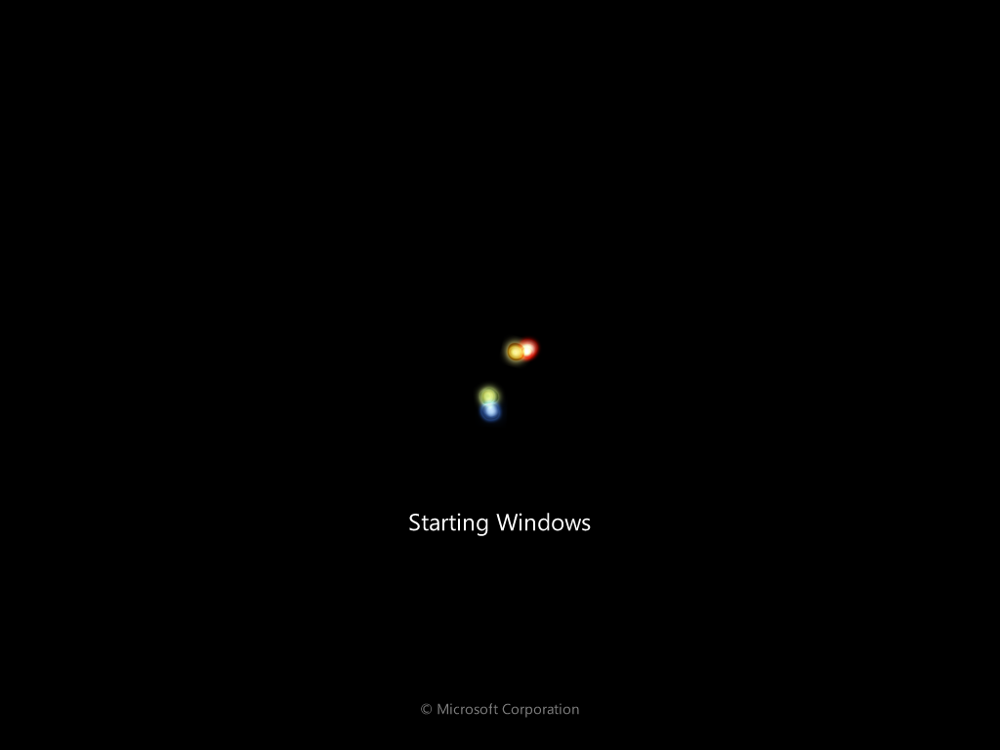

2. Start your PC again and choose the 'Launch Startup Repair' option.
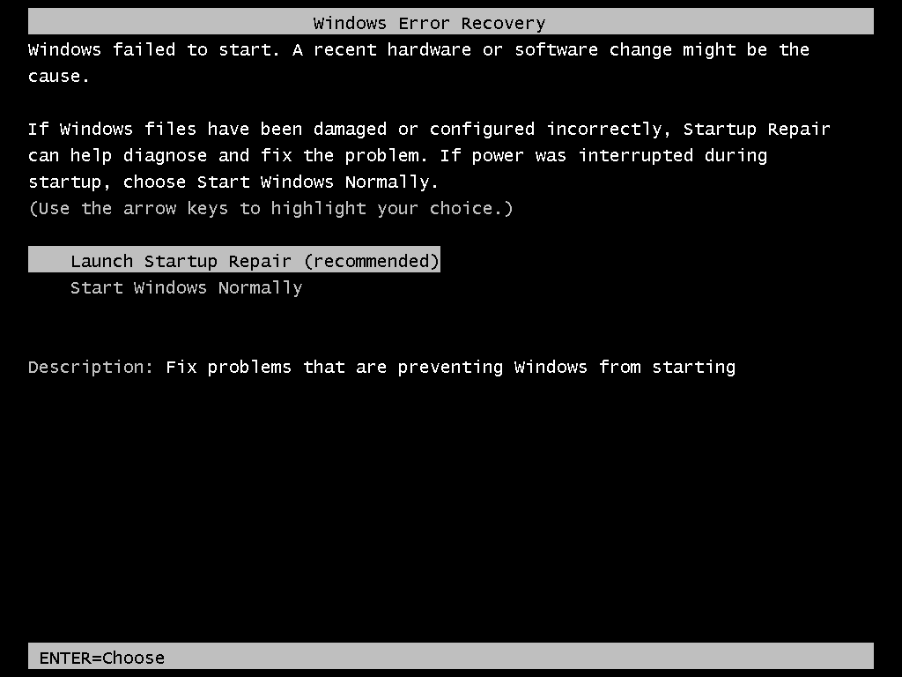

3. Once Windows has loaded all the nececary files, you'll see this. This stage can take a while. Be patience.
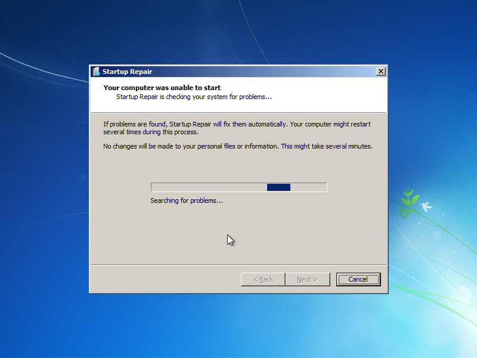

4. When you see this, click on 'View problem details'. Clicking on anything else will result in a reboot and you'll have to redo everything.
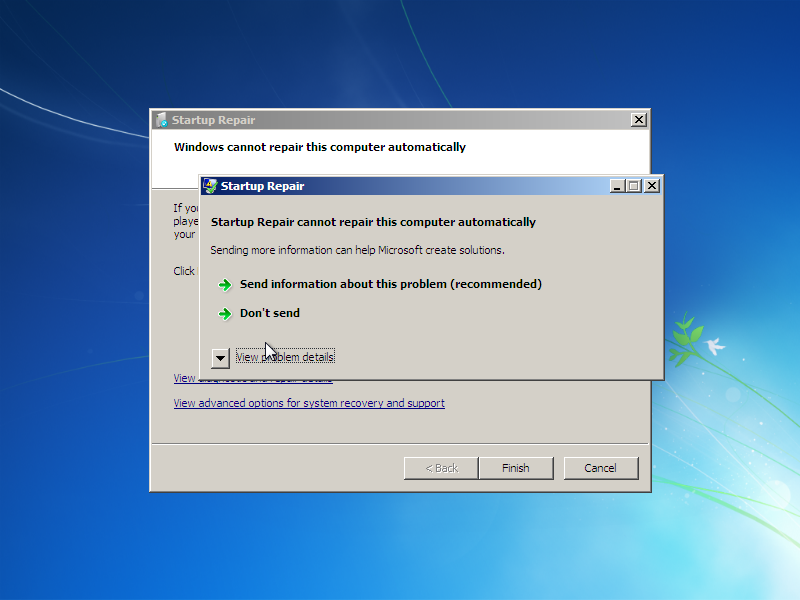

5. You'll now see some information about your OS, just ignore that and scroll to the bottom where you'll find a link to 'X:\windows\system32...' 
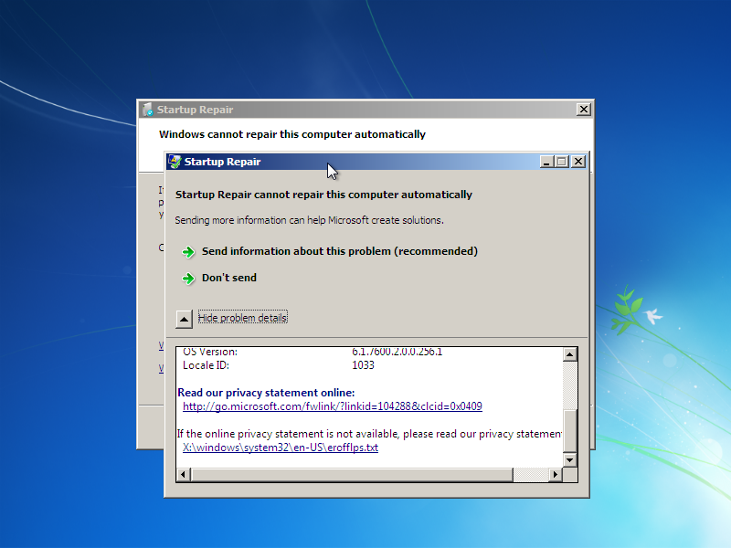

6. When you click on that link, it'll show you the document in Notepad. The document itself is not intresting. Click on File -> Save As..
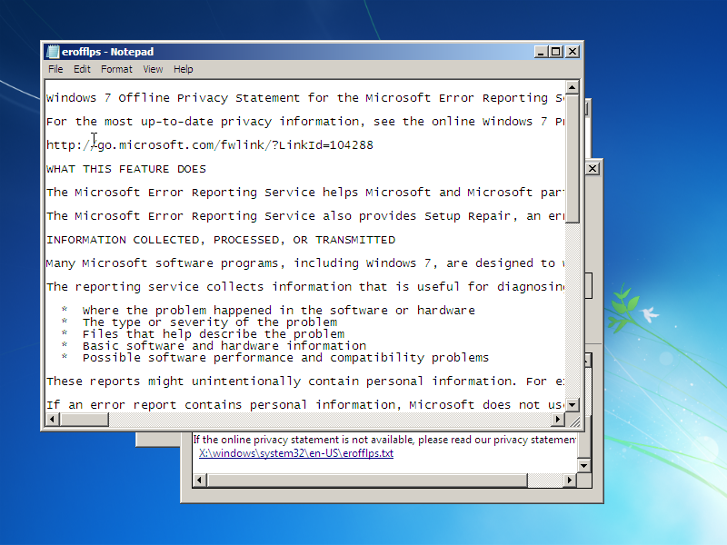

7. Navigate to 'system32'.
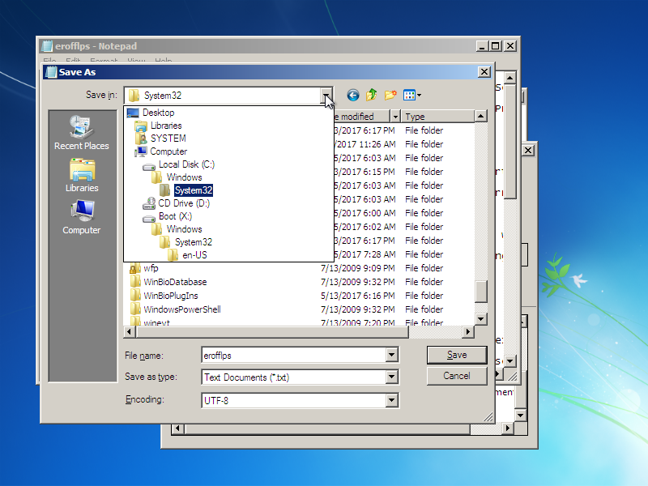

8. Change the 'Save as type' option to 'All files'. You should now see all files and folders in the system32 directory.
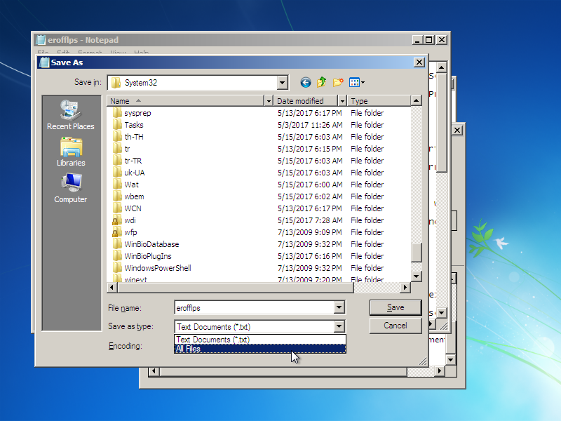

9. Scroll down until you see a file with the name 'sethc'. Rename this file to 'sethc1'. 
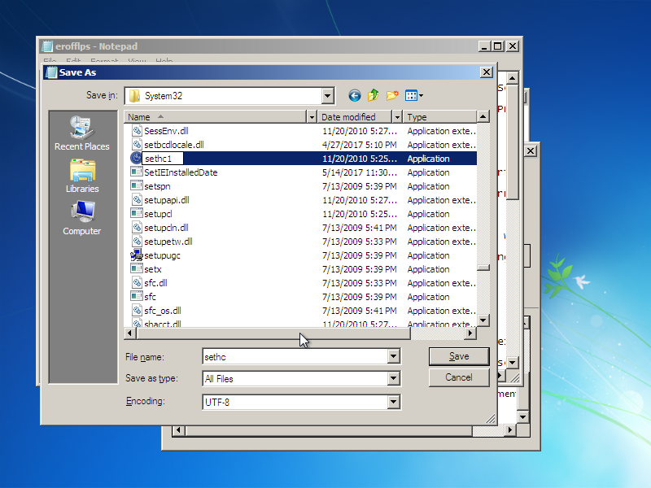

10. Scroll back up until you see cmd. Rightclick then Copy. Once you've done that just paste it again. It'll have the name 'cmd - copy'. Rename that file to 'sethc'.
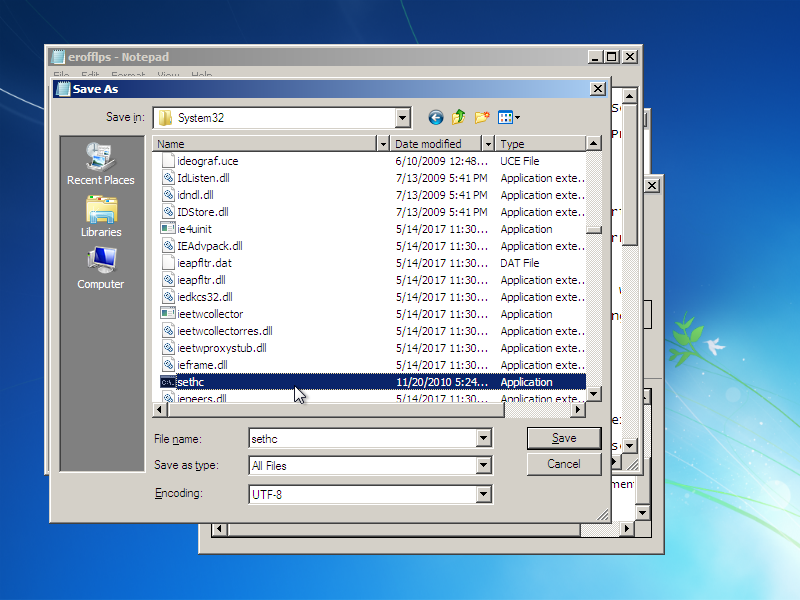

11. Once you're done, press 'Cancel', close the other windows and click 'Finish'. 
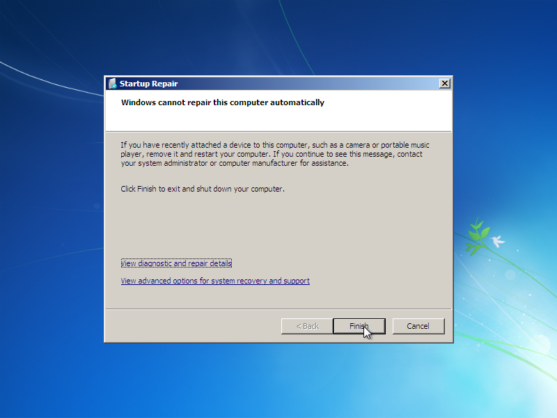 
#### You should have the following files:
* cmd (A black icon)
* sethc (A black icon)
* sethc1 (A blue circular icon)